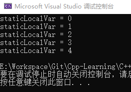
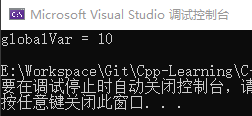
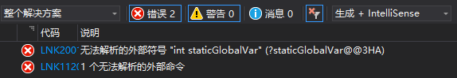
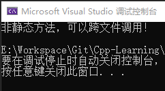
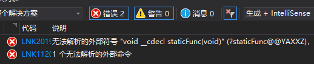
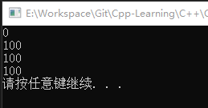

本节内容
 - [x] 静态局部变量
 - [x] 静态全局变量
 - [x] 静态方法
 - [x] 静态成员变量（C++）
 - [x] 静态成员函数（C++）

# 一、static在C语言中的使用

**非多文件共享变量或方法，应声明为静态全局变量或静态方法，避免重名冲突！**

**静态局部变量：解耦合，使程序模块化！**

|                          | 作用域     | 生命周期 |
| ------------------------ | ---------- | -------- |
| 静态局部变量（修饰变量） | 当前函数体 | 当前进程 |
| 静态全局变量（修饰变量） | 当前文件   | 当前进程 |
| 静态方法（修饰方法）     | 当前文件   | 当前进程 |

## 1.1 静态局部变量

static修饰局部变量，该变量在整个进程中只初始化一次，当所处函数返回（结束）时其值保持不变。

**示例程序**：

```cpp
#include <iostream>

void static_Test()
{
	static int staticLocalVar = 0;	//静态局部变量：staticLocalVar
	std::cout << "staticLocalVar = " << staticLocalVar++ << std::endl;
}

int main()
{
	for (int i = 0; i < 5; i++)
	{
		static_Test();
	}

	return 0;
}
```

执行结果：



如图，重新调用函数时，静态局部变量staticLocalVar会保持函数上次运行结束时的值。

## 1.2 静态全局变量

static修饰全局变量，限定该变量只能在当前文件内使用。

以下示例将对全局变量与静态全局变量进行对比。

**示例1（全局变量）**：

```cpp
//file static_02.cpp
int globalVar = 10; //全局变量

//file static_01.cpp
#include <iostream>

void static_Test()
{
	extern int globalVar; //使用extern声明全局变量globalVar
	std::cout << "globalVar = " << globalVar << std::endl;
}

int main()
{
	static_Test();
	return 0;
}
```

执行结果：



**示例2（静态全局变量）**：

```cpp
//file static_02.cpp
static int globalVar = 10; //全局变量

//file static_01.cpp
#include <iostream>

void static_Test()
{
	extern int staticGlobalVar; //使用extern声明静态全局变量globalVar
	std::cout << "staticGlobalVar = " << staticGlobalVar << std::endl;
}

int main()
{
	static_Test();
	return 0;
}
```

执行未成功：



## 1.3 静态方法

static修饰方法（函数），限定该函数只能在当前文件内使用。

以下示例将对静态方法与普通方法进行对比。

**示例1（普通方法）**：

```cpp
//file static_02.cpp
#include <iostream>

void func()
{
	std::cout << "非静态方法，可以跨文件调用！" << std::endl;
}

//file static_01.cpp
#include <iostream>

void static_Test()
{
	extern void func();
    func();
}

int main()
{
	static_Test();
	return 0;
}
```

执行结果：



**示例2（静态方法）**：

```cpp
//file static_02.cpp
#include <iostream>

void static staticFunc()
{
	std::cout << "静态方法，无法跨文件调用！" << std::endl;
}

//file static_01.cpp
#include <iostream>

void static_Test()
{
	extern void staticFunc();
    staticFunc();
}

int main()
{
	static_Test();
	return 0;
}
```

执行未成功：



# 二、static在C++中的扩展

**静态成员变量**：被static修饰的类的成员变量。

**静态成员方法**：被static修饰的类的成员方法。

## 2.1 静态成员变量/静态成员方法的特点

1. 静态成员变量在编译阶段已分配好内存（ 全局/静态存储区 ）。
2. ***静态成员变量在类内声明，在类外初始化。***
3. 类的所有对象共享一份静态成员变量数据。
4. ***静态成员函数只能调用静态成员变量***（非静态成员方法可以调用静态成员变量）。
5. 私有静态成员函数/方法只能间接通过类的实例的公有方法访问。

## 2.2 静态成员变量/静态成员方法的访问（使用）

- 通过类名调用。
- 通过对象调用。

**代码示例：**

```cpp
#include <iostream>

class Person
{
public:
	static int m_A;		//静态成员变量（类内声明）
	static void func()	//静态成员方法
	{
		m_A = 100;		//静态成员方法只能访问静态成员变量。
		std::cout << m_A << std::endl;
	}
};

int Person::m_A = 0;	//静态成员变量（类外初始化）

void test_Static()
{
	//1.通过对象调用
	Person p1;
	std::cout << p1.m_A << std::endl;		//0
	p1.func();								//100

	//2.通过类名调用
	std::cout << Person::m_A << std::endl;	//100
	Person::func();							//100
}

int main()
{
	test_Static();

	system("pause");
	return 0;
}
```

执行结果：



